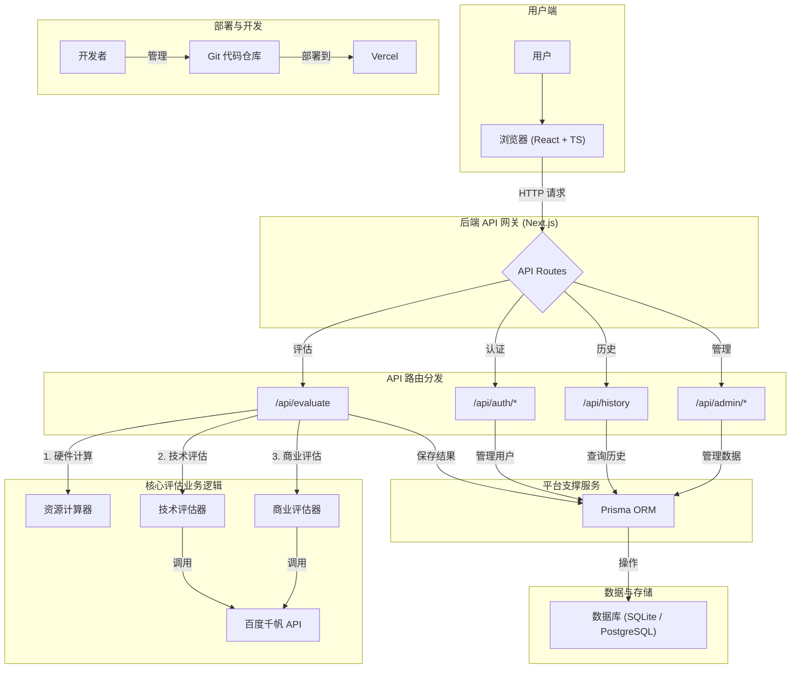

# AI 企业需求计算器 - 技术架构图 (v10 - 平台完整版)

此版本在详细业务逻辑的基础上，补充了支撑整个应用运行的平台自身技术栈，如认证、历史记录、管理后台等，是一份更全面的架构图。

## 架构说明 (平台完整版)

1.  **前端 (Frontend)**:
    *   用户通过基于 **React** 和 **TypeScript** 的前端界面与应用交互。

2.  **后端 API 网关 (`/api/*`)**:
    *   所有前端请求都首先到达 Next.js 的 API 路由层，它扮演着**API 网关**的角色。
    *   网关根据请求路径，将请求分发到不同的后端服务模块。

3.  **后端服务模块**:
    *   **核心评估业务逻辑**:
        *   由 `/api/evaluate` 路由触发，采用**流式响应**。
        *   它作为**总控制器 (Orchestrator)**，依次调用**资源计算器**、**技术评估器**和**商业评估器**。
        *   评估器模块最终会调用**百度千帆 API** 来生成分析报告。
    *   **平台支撑服务**:
        *   **认证服务 (`/api/auth/*`)**: 处理用户注册、登录，并使用 JWT 进行会话管理。
        *   **历史服务 (`/api/history`)**: 提供用户历史评估记录的查询功能。
        *   **管理服务 (`/api/admin/*`)**: 提供给管理员使用的后台管理接口，如用户管理、评估数据查看等。

4.  **数据层 (Data Layer)**:
    *   **Prisma ORM** 是唯一的数据库访问层，所有需要数据持久化的服务（包括评估业务和平台服务）都通过它与数据库交互。
    *   数据库在开发时使用 **SQLite**，生产环境可配置为 **PostgreSQL**。

5.  **部署与开发**:
    *   项目通过 **Git** 进行版本控制，并设计为在 **Vercel** 上进行一键部署。

这个版本的架构图全面地展示了应用的全貌，既包括了核心的 AI 评估业务流，也涵盖了支撑平台运行的基础技术栈。
