# AI 企业需求计算器 - 技术架构图 (v11 - 详细前端版)

此版本在平台完整版的基础上，对前端架构进行了详细拆解，展示了页面、核心业务组件和基础UI组件之间的层次关系。

```mermaid
graph TD
    subgraph "前端架构 (React + Next.js)"
        direction LR
        
        subgraph "页面 (Pages)"
            HomePage["主页 (/page.tsx)"]
            AdminPage["管理后台 (/admin/page.tsx)"]
        end

        subgraph "核心业务组件 (components/)"
            Dashboard["评估仪表盘"]
            History["历史记录侧边栏"]
            EvaluationDisplays["评估结果展示"]
            Auth["认证对话框"]
        end
        
        subgraph "基础 UI 组件 (components/ui)"
            ShadcnUI["Shadcn UI (按钮, 卡片, 表单等)"]
        end

        subgraph "状态与逻辑"
            Hooks["React Hooks (State, Effect)"]
        end

        HomePage --> Dashboard
        HomePage --> History
        Dashboard --> EvaluationDisplays
        
        Dashboard -- "使用" --> ShadcnUI
        History -- "使用" --> ShadcnUI
        Auth -- "使用" --> ShadcnUI

        HomePage -- "管理状态" --> Hooks
        Dashboard -- "管理状态" --> Hooks
    end

    subgraph "后端 API 网关 (Next.js)"
        Frontend["前端应用"] -- "HTTP 请求" --> API_Gateway{"API Routes"}
    end

    subgraph "API 路由分发"
        direction LR
        API_Gateway -- "评估" --> Evaluate_API["/api/evaluate"]
        API_Gateway -- "认证" --> Auth_API["/api/auth/*"]
        API_Gateway -- "历史" --> History_API["/api/history"]
        API_Gateway -- "管理" --> Admin_API["/api/admin/*"]
    end

    subgraph "核心评估业务逻辑"
        Evaluate_API -- "串行调用" --> Resource_Calculator["资源计算器"]
        Evaluate_API --> Technical_Evaluator["技术评估器"]
        Evaluate_API --> Business_Evaluator["商业评估器"]
        
        Technical_Evaluator -- "调用" --> Qianfan_API["百度千帆 API"]
        Business_Evaluator -- "调用" --> Qianfan_API
    end

    subgraph "平台支撑服务"
        Auth_API -- "管理用户" --> Prisma_ORM["Prisma ORM"]
        History_API -- "查询历史" --> Prisma_ORM
        Admin_API -- "管理数据" --> Prisma_ORM
        Evaluate_API -- "保存结果" --> Prisma_ORM
    end

    subgraph "数据与存储"
        Prisma_ORM -- "操作" --> Database["数据库 (SQLite / PostgreSQL)"]
    end

    %% Link Frontend to Backend
    linkStyle 0 stroke-width:2px,fill:none,stroke:blue;
    classDef frontend fill:#D5F5E3,stroke:#333,stroke-width:2px;
    class Frontend frontend;
```

## 架构说明 (v11 - 详细前端版)

1.  **前端架构 (Frontend Architecture)**:
    *   **页面 (Pages)**: 作为应用的顶层入口，由 Next.js 的 App Router 管理。
    *   **核心业务组件 (Core Components)**: 位于 `/components` 目录，是构成应用核心功能的可复用模块，例如 `EvaluationDashboard` 和 `HistorySidebar`。这些组件组合在一起，构成了用户所见的页面。
    *   **基础 UI 组件 (UI Components)**: 位于 `/components/ui`，是基于 `shadcn/ui` 的底层、无状态的 UI 控件，为核心组件提供统一的视觉风格。
    *   **状态与逻辑 (State & Hooks)**: 使用 React Hooks (`useState`, `useEffect`) 和自定义 Hooks 来管理组件的内部状态、处理数据请求等副作用。

2.  **后端 API 网关 (`/api/*`)**:
    *   前端通过 Next.js 的 API 路由层与后端交互，该层扮演着**API 网关**的角色，根据请求路径将请求分发到不同的服务模块。

3.  **后端服务模块**:
    *   **核心评估业务逻辑**: 由 `/api/evaluate` 路由触发，采用**流式响应**，依次调用**资源计算器**、**技术评估器**和**商业评估器**，并最终调用**百度千帆 API**。
    *   **平台支撑服务**: 包括处理用户认证、历史记录查询和后台管理的 API。

4.  **数据层 (Data Layer)**:
    *   **Prisma ORM** 是唯一的数据库访问层，所有需要持久化的服务都通过它与数据库交互。

5.  **部署与开发**:
    *   项目通过 **Git** 进行版本控制，并设计为在 **Vercel** 上进行一键部署。
